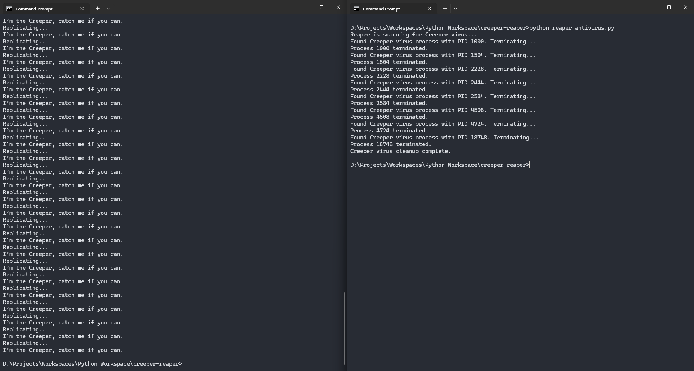

# Creeper Virus and Reaper Program Simulation

This project is an educational simulation of the first known computer virus, the **Creeper Virus**, and the first antivirus program, the **Reaper Program**. The purpose is to illustrate the history of malware and antivirus development.

## Project Overview

- **Creeper Virus**: A simple self-replicating program that simulates the behavior of the first computer virus (Creeper). It displays a message and tries to replicate itself.
- **Reaper Program**: A program designed to simulate the removal of the Creeper virus, much like the Reaper program was used to remove the original Creeper virus.

## Files

### 1. **Creeper Virus (`creeper_virus.py`)**

This file contains the implementation of the Creeper virus. The virus prints a message and tries to replicate itself by calling the script again.

### 2. **Reaper Program (`reaper_program.py`)**

This file contains the implementation of the Reaper program, which "hunts" and "removes" the Creeper virus by terminating its processes.

## How to Run

---

## 📸 Demo

Here’s what the output of the Creeper simulation looks like:



> You can replace this image with your own screenshot showing the console behavior.

---

## 🚀 How to Run

### Step 1: Clone this repository

```bash
git clone https://github.com/yourusername/creeper-reaper.git
cd creeper-reaper
```

### 2. Install Requirements

```bash
pip install psutil
```

### 3. Run Creeper (in one terminal)

```bash
python creeper_virus.py
```

### 4. Run Reaper (in another terminal)

```bash
python reaper_program.py
```
